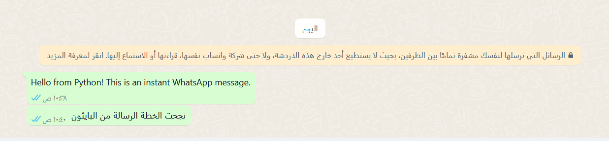

# WhatsApp Messaging Script with Twilio

This Python script allows you to send WhatsApp messages using the Twilio API. It leverages environment variables to securely handle credentials.

## Prerequisites

Before you begin, ensure you have the following:

- A Twilio account with access to WhatsApp messaging services.
- A Twilio WhatsApp-enabled phone number.
- Python installed on your machine.
- `twilio` and `python-dotenv` packages installed in your Python environment.

## Installation

1. Clone this repository to your local machine or download the script file directly.
2. Navigate to the script's directory in your terminal or command prompt.
3. Install the required Python packages:

   ```bash
   pip install -r requirements.txt
   ```

4. Create a `.env` file in the same directory as your script with the following contents:

   ```plaintext
   TWILIO_ACCOUNT_SID=your_account_sid_here
   TWILIO_AUTH_TOKEN=your_auth_token_here
   TWILIO_FROM_WHATSAPP_NUMBER=whatsapp:your_twilio_whatsapp_number_here
   ```

   Replace `your_account_sid_here`, `your_auth_token_here`, and `your_twilio_whatsapp_number_here` with your Twilio Account SID, Auth Token, and WhatsApp-enabled phone number, respectively.

## Usage

1. Ensure your `.env` file is correctly set up with your Twilio account details and WhatsApp number.
2. Modify the message body and the recipient number in the script as needed. The recipient number should be in the format `whatsapp:+international_number`, e.g., `whatsapp:+96655XXXXXXX`.
3. Run the script:

   ```bash
   python main.py
   ```


4. Upon successful execution, the script will print the message SID, status, and price information to the console, indicating that the message has been sent successfully.

## Troubleshooting

- Ensure all environment variables are correctly set in the `.env` file.
- Verify that the Twilio WhatsApp number is correctly configured for sending messages.
- Check that the recipient's phone number is entered correctly and includes the full international dialing format prefixed with `whatsapp:`.
- If you encounter HTTP errors, double-check your Account SID and Auth Token for accuracy.

For more detailed information, visit the [Twilio API documentation](https://www.twilio.com/docs/whatsapp/api).

## License

This script is released under the MIT License. See the LICENSE file for details.

## Contact

For support or queries, please file an issue in the repository or contact the script maintainer at `baderalotaibi3@gmail.com`.

### WhatsApp Message Sent Successfully using Twilio API


### WhatsApp Messaging Script with Free package pywhatkit

